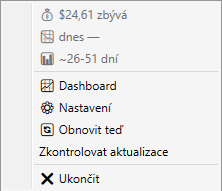
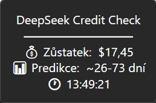
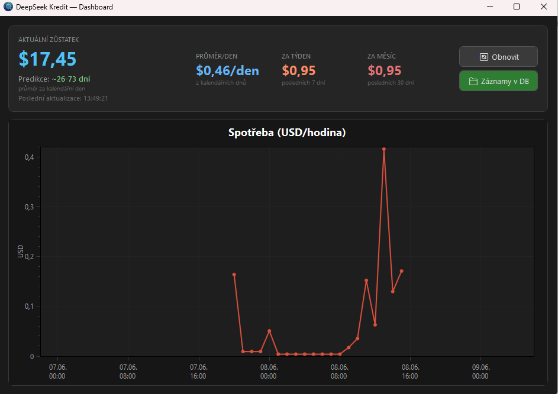

# DeepSeek Credit Checker

**Monitor your DeepSeek API credit balance from the Windows system tray.**  
*v1.4.0 — released 2026-06-10*

---

🇬🇧 **English**

A lightweight Windows application that runs in the system tray and periodically checks your DeepSeek API account balance. Shows your balance directly on the tray icon with a color indicator, displays details on hover, predicts remaining credit days, and alerts you when balance drops below a configurable threshold.

### Features

- **🎨 Balance on tray icon** — the icon dynamically shows your current balance as a number with status colors: green (OK), orange (approaching threshold), red (critical), blue (awaiting key)
- **💰 Balance in hover** — tooltip shows current balance, today's spend, prediction, and last update time
- **📊 Dashboard** — hourly spend chart with calendar-day aggregation, daily/weekly/monthly spend stats
- **📈 Prediction** — estimates remaining days based on average daily spend per calendar day
- **⚠️ Custom notification toast** — dark-themed popup in bottom-right corner with fade-in animation
- **🔒 Secure** — API key encrypted with Windows DPAPI
- **🌐 Multi-language** — Czech and English built-in; add your own via JSON files in `Lang/`
- **📁 Data browser** — view and delete historical balance records with multi-select
- **📝 Logging** — errors logged to file; configurable log path for multi-PC sync
- **🗄️ Configurable DB path** — share database across PCs via network drive or cloud sync
- **🔄 Auto-update** — checks for new releases on startup and every 4 hours; one-click download and install from GitHub Releases
- **🚀 Start with Windows** — optional autostart via a checkbox in Settings
- **💚 Recharge detection** — when you top up your credit a positive toast confirms the new balance
- **🔑 Test API key** — validate your key immediately with one click in Settings
- **🌙 Dark theme** — all windows with modern dark design

### How to use

1. Download the latest build from [GitHub Releases](https://github.com/hanyscz/DeepSeekCreditCheck/releases)
2. Run `DeepSeekCreditCheck.UI.exe`
3. Right-click the tray icon → **⚙️ Settings** → enter your DeepSeek API key
4. Click **Save** — app restarts and begins polling
5. When a new version is released, you'll get a notification — click to update automatically

Your API key can be obtained at [platform.deepseek.com/api_keys](https://platform.deepseek.com/api_keys).

### Configuration

Open **⚙️ Settings** from the tray menu:

| Setting | Description |
|---------|-------------|
| API Key | Your DeepSeek API key (encrypted with Windows DPAPI) |
| Alert threshold | Balance below this triggers a notification (default $2.00) |
| Check interval | How often to poll the API (5–60 min) |
| Language | UI language — add your own in `Lang/*.json` |
| Log path | Custom log file location (leave empty for default) |
| DB path | Custom database location for sharing between PCs |
| Start with Windows | Register the app for automatic startup |

### Test notification

Settings window has an **🔔 Test notification** button that shows a sample low-balance alert in the custom toast popup.

### Test API key

Settings window has an **🔑 Otestovat klíč** button that immediately validates your API key. It shows the current balance on success, distinguishes an invalid key (HTTP 401) from a network error — no need to wait for the next poll cycle.

### Single instance

Only one instance of the app can run at a time. If you try to start it again, the second launch exits silently — preventing duplicate polling and tray icons.

### Data browser

Open **📁 Záznamy v DB** from the Dashboard to browse all balance history records. You can:
- View records sorted by time (newest first)
- Select multiple records (hold Ctrl) and delete them
- Export all records to a CSV file via the **📥 Export CSV** button

### Adding a language

1. Copy `Lang/en.json` → `Lang/fr.json`
2. Translate the values inside
3. Set the `"lang_name"` key to the display name (e.g. `"Français"`)
4. The new language appears automatically in Settings → Language

---

🇨🇿 **Česky**

Odlehčená Windows aplikace běžící v systémové trayi, která pravidelně kontroluje zůstatek na DeepSeek API účtu. Zobrazuje zůstatek přímo na tray ikoně s barevným indikátorem, podrobnosti v tooltipu při najetí myší, předpovídá na jak dlouho kredit vydrží a upozorní při poklesu pod nastavenou mez.

### Funkce

- **🎨 Zůstatek na ikoně** — ikona dynamicky zobrazuje aktuální zůstatek jako číslo s barvou: zelená (OK), oranžová (blíží se prahu), červená (pod prahem), modrá (čeká na klíč)
- **💰 Zůstatek v trayi** — tooltip při najetí myší ukazuje zůstatek, dnešní spotřebu, predikci a čas
- **📊 Dashboard** — graf hodinové spotřeby, dnešní spotřeba, průměr/den, statistiky za týden a měsíc
- **📈 Predikce** — odhad zbývajících dní podle průměrné denní spotřeby z kalendářních dnů
- **⚠️ Vlastní notifikace** — tmavý toast v pravém dolním rohu s animací
- **🔒 Bezpečnost** — API klíč šifrovaný Windows DPAPI
- **🌐 Vícejazyčnost** — čeština a angličtina; vlastní jazyk přidáš přes JSON v `Lang/`
- **📁 Prohlížeč dat** — prohlížení a mazání historických záznamů s možností výběru více položek
- **📝 Logování** — chyby se zapisují do souboru; nastavitelná cesta pro synchronizaci mezi PC
- **🗄️ Sdílení databáze** — vlastní cesta k DB pro sdílení mezi počítači
- **🔄 Auto-update** — kontrola nových verzí při startu a každé 4 hodiny; stažení a instalace na jedno kliknutí z GitHub Releases
- **🚀 Spuštění při startu Windows** — volitelný autostart přes checkbox v Nastavení
- **💚 Detekce dobití** — při dobití kreditu se zobrazí pozitivní toast s novým zůstatkem
- **🔑 Otestovat klíč** — okamžité ověření API klíče tlačítkem v Nastavení
- **🌙 Tmavý režim** — všechna okna v moderním dark designu

### Použití

1. Stáhni build z [GitHub Releases](https://github.com/hanyscz/DeepSeekCreditCheck/releases)
2. Spusť `DeepSeekCreditCheck.UI.exe`
3. Klikni pravým na tray ikonu → **⚙️ Nastavení** → zadej DeepSeek API klíč
4. Klikni **Uložit** — aplikace se restartuje a začne kontrolovat zůstatek
5. Při vydání nové verze se zobrazí notifikace — klikni pro automatickou aktualizaci

API klíč získáš na [platform.deepseek.com/api_keys](https://platform.deepseek.com/api_keys).

### Nastavení

Otevři **⚙️ Nastavení** z tray menu:

| Nastavení | Popis |
|-----------|-------|
| API Klíč | Tvůj DeepSeek API klíč (šifrovaný DPAPI) |
| Práh upozornění | Zůstatek pod touto částkou spustí notifikaci (výchozí $2.00) |
| Interval kontroly | Jak často volat API (5–60 min) |
| Jazyk | Jazyk UI — vlastní přidáš do `Lang/*.json` |
| Cesta k logu | Vlastní umístění log souboru (nech prázdné pro výchozí) |
| Cesta k databázi | Vlastní umístění DB pro sdílení mezi PC |
| Spuštění při startu | Zaregistruje aplikaci pro automatický start Windows |

### Test notifikace

V Nastavení je tlačítko **🔔 Test notifikace**, které zobrazí ukázkovou nízkorozpočtovou výstrahu v custom toast okně.

### Otestovat klíč

V Nastavení je tlačítko **🔑 Otestovat klíč**, které okamžitě ověří platnost API klíče. Při úspěchu zobrazí aktuální zůstatek, rozlišuje neplatný klíč (HTTP 401) od síťové chyby — není nutné čekat na další plánovanou kontrolu.

### Jediná instance

Aplikaci lze spustit pouze jednou. Při druhém pokusu o spuštění se nová instance tiše ukončí — zabraňuje duplicitnímu pollingu a vícenásobným tray ikonám.

### Prohlížeč dat

Otevři **📁 Záznamy v DB** z Dashboardu. Můžeš:
- Prohlížet záznamy seřazené podle času (nejnovější první)
- Vybrat více záznamů (podrž Ctrl) a smazat je
- Exportovat všechny záznamy do CSV souboru tlačítkem **📥 Export CSV**

### Přidání jazyka

1. Zkopíruj `Lang/en.json` → `Lang/de.json`
2. Přelož hodnoty uvnitř
3. Nastav klíč `"lang_name"` na zobrazovaný název (např. `"Deutsch"`)
4. Nový jazyk se automaticky objeví v Nastavení → Jazyk

---

## Build

```bash
dotnet publish src/DeepSeekCreditCheck.UI/DeepSeekCreditCheck.UI.csproj -c Release -r win-x64 --self-contained false -o publish/
```

Requires .NET 8 SDK and Windows (DPAPI dependency).

---

## Screenshots

<p align="center">
  
  
  <br/>
  
</p>
